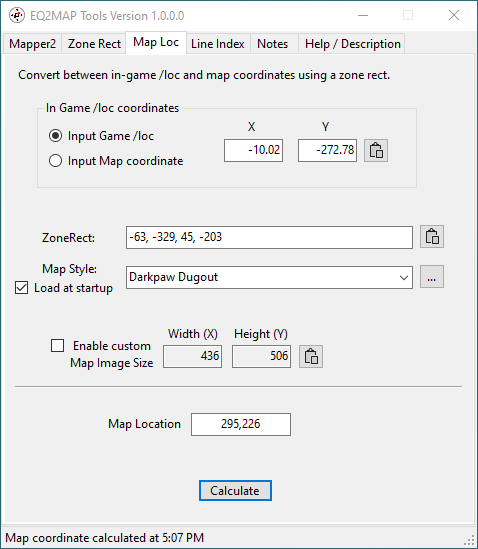
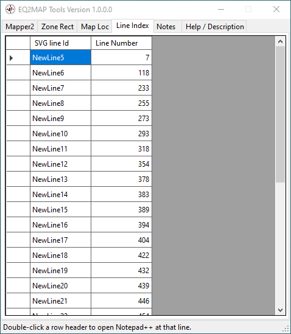

# EQ2MAP Tools
This utility is intended to streamline the process of creating maps for the for the EQ2MAP UI add-on for the EverQuest 2 game.

This program is an update to:
* Rex 'SaintPeter' Schrader's mapper2 and log_cleaner Perl scripts
* Tacoman's ZoneRect Calculator.

This program simplifies and automates several of the tasks required to make the "lines" portion of an EQ2MAP.

The original tools are described here: https://maps.eq2interface.com/index.php?action=maptutorial&page=2

## Installation
To use the program, download the zip file from the [releases](https://github.com/jeffjl74/Eq2MapTools/releases) page and unzip it in your desired folder.

The program is one executable but it does depend upon Microsoft's .NET 8 framework library. If this is not already installed on your computer, the first execution of the program will prompt you to download it. The download is automatic but you must run the downloaded file to do the actual installation. After that one time installation, the program should run.
## Overview
Starting a new map generally consists of at least the following steps:
1. On the [Mapper2 Tab](#mapper2-tab), browse to the appropriate *Input Log File* containing the [Mapper Commands](#mapper-commands).
2. Browse to the desired *Output Folder*.
3. Press the *Find and add mapstyle names* button at the end of the *Base map name (Zone Name)* box and select the appropriate map style name. If the *Input Log File* did not contain the right map style name, you'll need to come up with it if you want an accurate \<ImageStyle\> (maybe by scanning a different log file).
4. Enter a *Map Level* if the map will have more than one level.
5. Press the [Run] button. This will generate the *Mapper File*, the *SVG File*, launch the selected editor/viewer(s), and populate the [Zone Rect Tab](#zone-rect-tab).

Details and other options for this tool are described in the following sections.

You would continue developing the map using other tools:
* Edit the SVG file in Inkscape as described in the tutorial linked above.
* Import the Inkscape edited file into your image editing software. Photoshop steps are described in the original tutorial. For those of us that are "frugal" and using [GIMP](https://www.gimp.org/), following are some tips:
  * You can still start with the [photoshop template](http://www.eq2interface.com/downloads/info4910-PhotoshopMapTemplate-RegulationSize.html) from the tutorial.
  * For the "lines" layer in GIMP:
    * In Inkscape, hide the *layerX* text layer, where X is the highest layer number in Inkscape. (*Object->Layers and Objects* menu to open the layer list.) Then use the *Edit->Resize Page to Selection* menu to shrink the image to just the lines.
     	* Initially you'll need the *group_0* crosshair level showing. After collecting the actual crosshair locations, you can also hide that layer in Inkscape, save and re-import to hide the crosshairs in the final file.
    * Save the Inkscape file.
    * In GIMP, select the appropriate "Lines" layer under the appropriate "Floor" layer and use the *File->Open as layers* menu to open the Inkscape file.
	* In the *Render Scalable Vector Graphics* dialog, use the suggested *SVG Render* scale from the [Zone Rect Tab](#zone-rect-tab), or something of your choosing (keep the aspect ratio).
  * Adding layer masks for the textures is similar to Photoshop:
    * Create a separate layer containing the texture on the same "floor" as the lines. Position it below the lines layer in the layer list.
    * Select the "Lines" layer, use the *Fuzzy Select Tool* to select the areas the texture should "paint".
    * Use the *Select->Grow* menu to grow the selection by 1 pixel (to fill in anti-alias squiggles).
    * Select the texture layer, right click, and choose the *Add Layer Mask...* menu. In the resulting dialog, choose *Selection*, then the [Add] button.
  * To export the final file to DDS:
    * Hide the layers for the floors you are not exporting until the image looks like the actual map to be displayed in EQII.
	* Use the menu *Image->Flatten Image*.
    * Use the menu *File->Export As...*.  In the dialog, choose the folder and file name. Change the file name extension to "dds" and press [Export]. In the resulting dialog, choose *BC1 / DXT1* for the *Compression* and press [Export].
	* **Use the menu Edit->Undo Flatten Image** to restore the original file structure.

## Mapper2 Tab


The mapper2 and log_cleaner functions are conversions of the original Perl scripts with the following differences:
* The code is fixed so it recognizes color commands only when the word "color" is in an emote. 
* The code is fixed to recognize */em color* as "set to black", which didn't work in the Perl script.
* The *Map Level* is optional, e.g. if there is only one level.
* The "You have entered..." log file lines are recognized and copied to the mapper file to help generate the "displayname=" attribute for the mapstyles xml entry on the [Copy Button](#copy-button).
* The splitting by elevation into Inkscape groups works differently even though the C# looks like it should do the same thing the Perl script does. But the C# code result is logical, so I'm going with that. e.g. if you provide 2 numbers, you get 3 groups based upon the average elevation of a line (the program sorts the *Group by elevations* inputs so the order in the text box doesn't affect the outcome):
	* -infinity to #1,
	* #1 to #2,
	* #2 to +infinity
* *Group by elevations* overrides any **/em mapgroup** commands in the log file. i.e. **/em_mapgroup** comands are ignored and all groups are based on the line elevations.

The mapper tool adds some extra features:
* Multiple EQII log files can be processed at once by selecting multiple files in the *Browse for game log files* dialog.
	* If multiple files are selected, another dialog pops up so that the processing order can be set. To keep from potentially breaking things like line color and mapgroups, you would generally want to process the files in time order, i.e. oldest file first, newest file last.
* The button at the end of the *Base map name (Zone Name)* box scans the *Input Log Files* for map style names (which are the result of the **/show_map_style_name 1** command) and their associated zone names. If any are found, choosing one from the menu sets the map style as the *Base map name (Zone Name)*. Using a *Base map name (Zone Name)* from the list makes generation of an accurate mapstyles \<ImageStyle\> xml element more likely on the [Zone Rect tab](#zone-rect-tab) [Copy Button](#copy-button).  
	
* When grouping by elevation, checking the *Separate files* checkbox will generate a different SVG file for each elevation group. The file names will derive from incrementing the *Map Level* for each successive elevation group (or starting at "\_0" if *Map Level* is empty or not a number). If processing *Input Log Files*, the program still creates only one *Mapper File*. The automatic zone rect calculation will be for the first file, indicated in the *SVG File:* name on the [Zone Rect Tab](#zone-rect-tab). Zone rects for the other files can be calcualted using the [Open SVG...] button. The number of files generated is shown in the status line, in the above example by the *SVG (3)* indicating three SVG files.
* Just a portion of the *Input Log Files* can be extracted by using the *Log Filter Start Time* and/or *Log Filter End Time*. The button at the end will scan the current *Input Log Files* for the time range and populate the time pickers. Check the box to activate the filter.
* The *Build new mapper file from Input Log File(s)* option is the same functionality as the old Mapper2 batch file (mapper2 and log_cleaner) except that the SVG file is built from the "clean" mapper file instead of directly from the EQII log file.
* The *Append Input Log File(s) mapping lines to existing mapper file* option provides another way to gather mapping lines from different EQII log files into one mapper file.
* The *Use existing mapper file as is* option does not modify the mapper file when the [Run] button is pressed. Useful if you have hand-edited the mapper file.
* Two launch options are provided. I find it easier to manage browser tabs to view the SVG file while I'm still collecting and checking /loc data. Then use Inkscape when I'm ready to start editing.

## Mapper Commands
As before, the EQII commands that are saved in the mapper file are:

| Command                     | Description              |
| --------------------------- | ------------------------ |
|/em start new map line       | The next /loc is the first point of an Inkscape path. (And the previous /loc is the end point of the previous Inkscape path.)|
|/loc                         | Logs your current location.|
|/em color colorname          | Sets the line color to the specified colorname for all lines between the previous **/em start new map line** and the next **/em color**. If colorname is omitted, the line color will be black. Acceptable color names are here: https://johndecember.com/html/spec/colorsvg.html|
|/em mapgroup                 | This command immediately increments the group/layer number. The current line, that started with the previous **/em start new map line**, and following lines, will go into the new Inkscape group number.|
|/show_map_style_name&nbsp;1  | Turns on the generation of a log file entry for the internal name of a zone each time you zone somewhere. Logging the map style name helps with the [generation of an accurate mapstyles xml element](#copy-button) on the [Zone Rect Tab](#zone-rect-tab).|


## Zone Rect Tab


The major difference in the Zone Rect calculator is that this version can read the SVG file to extract and calculate the data for all the boxes. Pressing the [Mapper2 Tab](#mapper2-tab) [Run] button or the [Open SVG...] button automatically calculates a zone rect from the generated SVG file. The [Open SVG...] button can also open an Inkscape-edited Mapper2 file.
* Note that the SVG file does not contain zone name information. (Ref. [Copy Button](#copy-button))

The [Calculate] button is just like Tacoman's [Calculate] button. The information in the edit boxes is used to create the zonerect.

The *Map Area Usage* provides a simple preview of the area that the SVG lines  occupy in the *Map Image Size* with a crosshatch pattern. The particular example map displayed above is long and narrow and is probably a candidate for a different *Map Image Size* or sectioning method.

To calculate a zone rect directly from an SVG via the [Run] or [Open SVG...] button:
* Set the *Map Image Size* prior to using the [Run] or [Open SVG...] button.
	* The *In Game /loc Coordinates* are extracted directly from the *UL:* and *LR:* values in the SVG file.
	* The *Map crosshair coordinates* are calculated:
		* They are frequently off by a pixel or so (I can't figure out why).
		* The program picks a scaling factor to fit the SVG crosshairs into the Map Image Size and calculate the crosshair locations.  This is a suggestion as to how to scale the image to the map size when importing it into your image processing software.
      		* It adjusts the width so that the height is the map height. Or it adjusts the height so the width is the map width. The "less than the map size" dimension is displayed with a green background. Entering either of the numbers in your image processing software scaling factors should result in both numbers matching the displayed numbers.
        * Whether you use the suggested scale, or set your own, you should verify the crosshair locations in your image processing software and recalculate the zone rect if necessary.

### Copy Button

Copying the ZoneRect is also differnt from Tacoman's copy in that the entire XML attribute "zonerect=x1,y1,x2,y2" for the MapStyles file is copied to the clipboard by the [Copy] button. The checkboxes also allow:
* Adding the elevation "heightmin" and "heightmax" attributes to the copy if they were obtained from the SVG file.
* Adding the "availablerect" attribute, which is calculated to be the rectangle defined by the crosshair coordinates.
* Generating an entire MapStyles \<ImageStyle\> XML element for pasting into the appropriate MapStyles.xml file. The attributes will typically require some manual edits. For example, for multi-level maps, the "heightmax" and "heighmin" should abut between levels and the values pulled from the SVG file will probably not.
	* The program attempts to determine the "Name=" and "displayname=" attributes from the mapper file. Success depends on the presence of both the *Map style name:* and *You have entered* log lines in the proper order (zone name followed by map style) in the log file. If these conditions are missing or incorrect, the user must manually fix entries in the xml snippet.
      * The [Run] button on the [Mapper2 Tab](#mapper2-tab) populates the *Base map name (Zone Name)* drop list from the *Input Log Files*. Choosing a drop list entry usually works (though you probably want to remove any oh-so-helpful color codes from the zone name).
      * If the drop list does not contain the desired style/zone, but you have a log file that does, you can temporarily browse to different *Input Log Files*, use the *Find and add map styles* button at the end of the *Base map name (Zone Name)* box, then switch back to the log file you want to process.
      * Using the [Open SVG...] button on files associated with the *Base map name (Zone Name)* entry usually works.
        * For example, if the map style part of the *Base map name (Zone Name)* is "exp20_dun_djinn_palace_02_solo_", opening the second level "exp20_dun_djinn_palace_02_solo_1.svg" or "exp20_dun_djinn_palace_02_solo_1_inkscape.svg" should result in a "Name="exp20_dun_djinn_palace_02_solo_1". ("_inkscape" here representing the edited file is just an example and can be any arbitrary characters.)
	* The "Source=" DDS file name should be reasonable, but may require editing to match whatever name the user assigned to the DDS file.
    * The other entries should be correct according to the Zone Rect tab. The result will be something like this:
```xml
	<ImageStyle Name="exp20_dun_djinn_palace_02_solo_0" displayname="Vaashkaani: Golden Rule [Solo]" zonerect="-484, -334, 93, 335" availablerect="-470,-58,79,58" heightmin="2.95" heightmax="20.33" >
	<ImageFrame Source="images/maps/map_exp20_dun_djinn_palace_02_solo_0.dds" SourceRect="0,0,436,506" />
	</ImageStyle>
```


## Map Loc Tab


Given a zonerect and map size, this tab can
* calculate the X,Y cooridnates on the map given the game /loc coordinates
* calculate the game /loc given the map X,Y coordinates

With the *Input Game /loc* selected, pressing the clipboard button by the Y coordinate will paste the *In Game /loc coordinates* from the clipboard when set by the */loc clipboard* command in game.

The *ZoneRect* can be
* manually entered (4 numbers separated by space and/or comma)
* copied from the Zone Rect tab by pressing the little clipboard button at the end
* set from a mapstyles file

To use a mapstyles file, browse to it in your game UI eq2map2 folder using the 3 dots button. You would typically pick the *core_mapstyles.xml* or *_User_MapStyles.xml* file. Then choose a map name from the dropdown list. Check the box to automatically load that file when the program starts.

Auto-complete is on for the Map Style combobox, but a match has to start matching with the first character (e.g. if looking for "Darkpaw Dugout", you have to start typing "dark", not "dug" to get a match). And the auto-complete dropdown will probably be too narrow. It can be resized by grabbing the resize handle at its lower right.

## Line Index Tab


The [Run] button on the [Mapper2 tab](#mapper2-tab) also generates a cross reference between the mapper text file and the SVG file. The index is displayed on the Line Index tab. Double-clicking a line header (the leftmost column) opens the mapper text file in Notepad++ (https://notepad-plus-plus.org/) and positions the file at the "start new map line" for that SVG path.

When editing the file in Inkscape, the path names will match the *SVG line id* in the index. So if you find it easier to, for example, split a path in the text file rather than in Inkscape, you can identify the path name in Inkscape, use the index to jump to it in Notepad++, and edit the mapper file. You would then want to select the *Use existing mapper file as is* on the [Mapper2 tab](#mapper2-tab) to keep from overwriting your change with lines from the EQII log file. 

Of course, if you do add or delete something in the mapper file, all of the index entries below that change will be out of date until you [Run] again. So if you're making several changes it's probably quickest to start at the highest line number and work your way up the list.

The index is not generated if the *Group by elevations* option is used because the SVG lines are rearranged out of order from the log file. It's easy enough to make a run without grouping by elevation if you want an index.

## Notes Tab


The Notes Tab holds any free text you want to associate with the map and has no impact on the map making files.

The [Mapper2 Tab] *Base map name (Zone Name)* is used as the lookup key to a note.

The note is saved to memory only when you press the [Save] button. 

The notes in memory are saved to disk when the program closes.

## Program Development
The program was developed using Visual Studio 2022. The project files are included in this repository. The single executable is created using the Build menu `Publish Selection`.

